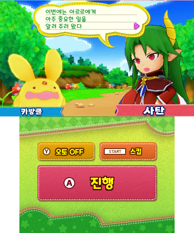

# 뿌요뿌요 크로니클 — 닌텐도 3DS

닌텐도 3DS **뿌요뿌요 크로니클** 한글 번역 패치입니다.

> **베타 v0.1.0** — 번역과 그래픽은 추후 변경될 수 있으며, 플레이 중 오류가 있을 수 있습니다.

## 다운로드 및 적용 방법

1. 일본판 원본을 준비합니다. 아래 SHA-256을 확인하세요.
2. [v0.1.0 패치 다운로드](https://github.com/mcpads/3ds-puyo-puyo-chronicle-kr-patch/releases/download/v0.1.0/puyo-puyo-chronicle-kr-v0.1.0.xdelta)
3. Delta Patcher 등 xdelta 패처로 원본 이미지에 적용합니다.

## 체크섬

| 구분 | SHA-256 |
| --- | --- |
| 원본 | `3d531f8ff1296eb55cbd9d43d9cf4b9f1907ecaf18707a44895be8bfc07741e5` |
| 패치 | `fab46675ac558330ceed02b9d5ae27a9e7e0c6cf23e9ae209409a9bc0a2da36c` |

[뿌요뿌요 시리즈 한글 패치 목록](https://github.com/mcpads/puyo-puyo-kr-patch)
